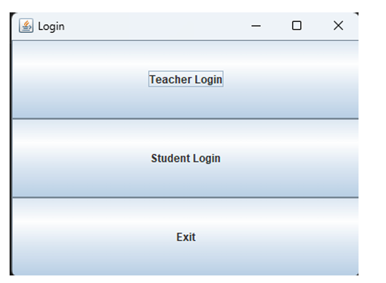
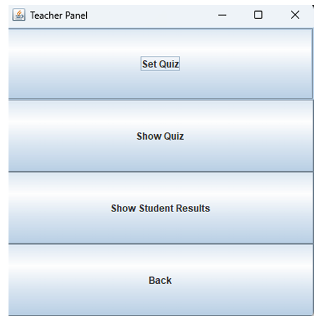
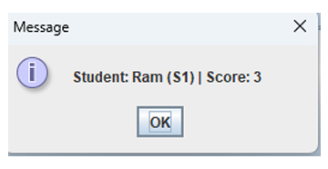

# Quiz Management System

A Java-based Quiz Management System developed using Java AWT/Swing and Object-Oriented Programming concepts.

## Features
- Teacher Login
- Student Login
- Create and Manage Quiz
- Attempt Quiz
- View Results
- File Storage using text files
- GUI-based interface

## Technologies Used
- Java
- AWT/Swing
- File Handling
- OOP Concepts

## Concepts Implemented
- Encapsulation
- Polymorphism
- Constructors
- Event Handling
- Exception Handling
- File I/O

## Screenshots

### Login Page


### Teacher Panel


### Student Panel


### Quiz Results


## How to Run

1. Compile the program:
```bash
javac QuizGUI.java
```

2. Run the program:
```bash
java QuizGUI

## Demo Video

[Watch Project Demo](https://youtu.be/YQ4dkMn2COQ)
```

## Author
Manya Chourasiya


